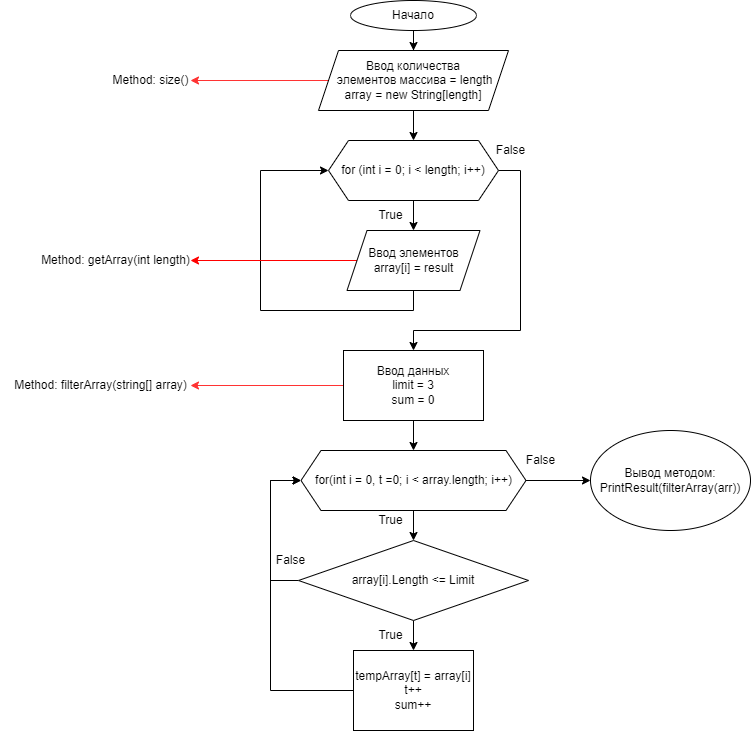

## Контрольная работа(задача) :

## Блок схема: 

## Описание решения:
 Решил данную задачу в 4 метода(функции)
 1. Метод size() Ничего не принимает, задаёт длину, которую пользователь вводит с консоли
 2. Метод getArray(int length) принимает длинну которую пользователь ввёл с консоли в методе size(). Задаёт элементы, которые пользователь вводит с консоли и записывает их в массив array. Колличество элементов в массиве array будет зависеть от той длины, которая задаётся в методе size() ---> array[length] = size()
 3. Метод filterArray(string[] array) принимает массив собранный методом getArray(length), вычисляет количество тех элементов массива, которые по длине меньше или равны limit(3) и записывает их в новый массив
 4. Метод PrintResult(string[] array) принимает результат return метода filterArray(arr) и показывает результат в консоль

